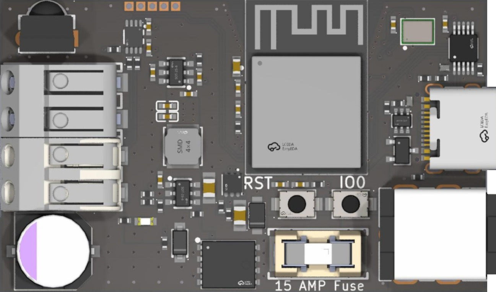
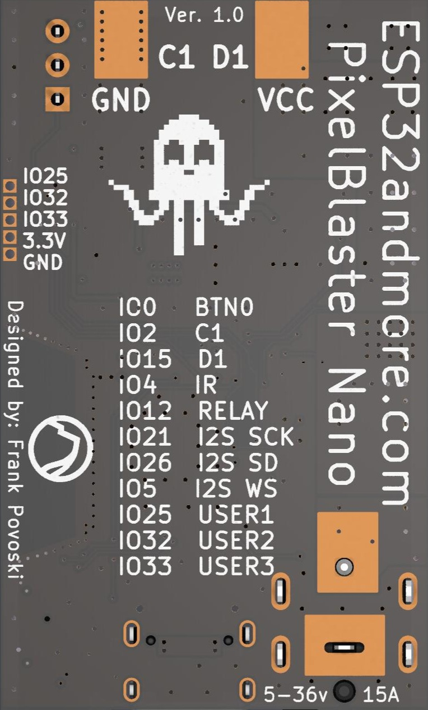

# PixelBlaster Nano
## Description

The PixelBlaster Nano is a feature-rich WLED controller in a compact form factor (32mm x 53 mm), offering high-current capabilities for any addressable lighting project you may have. It has all the features of much larger boards but at a cost point you cannot ignore. 
It supports virtually all LED strips and serial matrices using single-wire protocols, such as the WS2811 and WS2812B, to SPI (clocked-data) protocol devices, such as the WS2813 and SK9822, in 5V, 12V, 24V, and even the latest 36V strips. 

## Features 

* Uses the workhorse ESP32 dual-core 240MHz processor. 
* Two channels of 5-volt logic-level translated outputs using ultra-fast and high-current LVC technology with matched and modeled serial inline resistors for high quality signal drive over short or long cables.
* Low-profile Wago push-button terminal block for easy and secure electrical connections. 
* Compact form factor of 32 mm x 53 mm. 
* High-quality 4-layer impedance-controlled PCB with gold-plated connectors (ENIG) for durability and corrosion resistance. 
* ICS-43434 I2S 24-bit digital microphone with a sensitivity of -26 dB FS and SNR of 64 dBa. 
* Onboard ATtiny1616 controller manages the AP33772S Power Delivery 3.1 sink controller. 
* Input power: 5-36 volts @ 15-amp max. via high-current 5.5mm x 2.1mm DC power jack, or 5 volts @ 3-amps max. via USB-C connector. 
* 15-amp replaceable power fuse. 
* Onboard 100-amp Trench Power MOSFET "relay" that reduces current draw to just 80mA @ 5V when LEDs are turned off. 
* Overvoltage protection circuit on input power that shuts off power to LEDs and the board
* 330µF bulk electrolytic capacitor on power output to smooth power delivery. 
* Electrostatic Discharge (ESD) protection on all inputs. 
* 38kHz Infrared Remote Receiver (IRM) compatible with all WLED-supported remotes. 
* Supports ESP-NOW based remote controls. 
* Easy flashing of custom firmware or upgrades through the USB-C connector. 
* Pads exposing three ESP32 GPIOs for custom functions. 
* Output pads exposed for hardwired solder options. 
* Comes with a custom 3D-printed PLA+ case (design files available upon request). 
* Comes with JST-SM 3 or 4-pin pigtail connector. 
* Comes pre-flashed with the latest version of WLED. 

### Programming WLED

- The PixelBlaster Nano PD comes pre-programmed from the factory with the lastest version of WLED.  To update WLED, simply follow the instructions [here](https://kno.wled.ge/basics/getting-started/) under Software Update Procedure, Method 2.
- To reflash over the USB interface simply go [here](https://install.wled.me/). (Note: after reflashing due to a driver issue, disconnect the board from your PC and connect to a power adaptor where you can then enter in your WiFI credentials via the AP.

  
